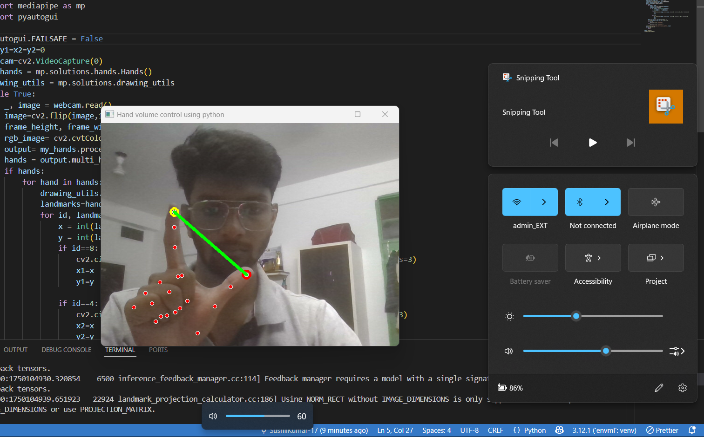

# 🖐️ Hand Gesture Volume Control using OpenCV & MediaPipe

Control your system's volume with a simple hand gesture using your webcam!  
This Python project utilizes **OpenCV**, **MediaPipe**, and **PyAutoGUI** to detect hand landmarks and control volume based on the distance between your thumb and index finger.

## 📸 Demo

### 🔊 Gesture to Increase/Decrease Volume

<br>

### 🎬 Watch DemoVideo
<video src="assets/Demo.mp4" controls width="600"></video>


---

## ⚙️ Tech Stack
- Python
- OpenCV
- MediaPipe
- PyAutoGUI

## 🚀 How it Works
- The webcam captures hand landmarks using MediaPipe.
- Landmark `8` (index finger tip) and `4` (thumb tip) are used to calculate distance.
- If the distance is **greater than 50**, the volume increases.
- If the distance is **less than 50**, the volume decreases.

## 🛠️ Installation

```bash
pip install opencv-python mediapipe pyautogui
